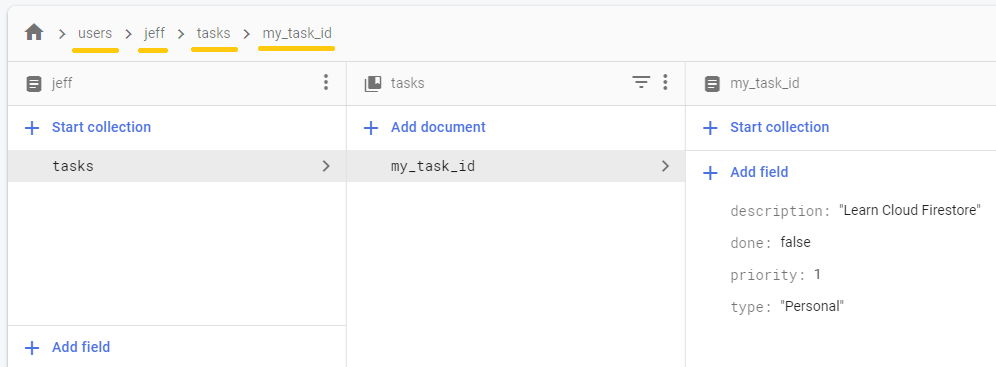

### FirestoreDocument-Android App Quickstart

## Introduction

This is an Android example app for how to use the [FirestoreDocument-Android library](https://github.com/alexmamo/FirestoreDocument-Android/blob/master/firestore-document/).

## Getting Started

In order to make it work, you need to create a [Firebase project](https://firebase.google.com/docs/android/setup) and a very simple [Cloud Firestore database](https://firebase.google.com/docs/firestore) with only a single document that looks like this:

## Run the App

When opening the app, the result that you'll see is the size of `my_task_id` document that is set to a `TextView`:

.

Note: All documents size returned by this library are in bytes, the example above shows 147 bytes
