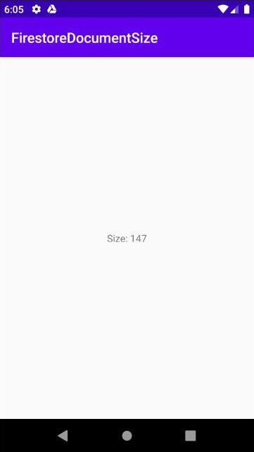

### FirestoreDocument-Android App Quickstart

##Introduction

This is an Android example app for how to use the [FirestoreDocument-Android library](https://github.com/alexmamo/FirestoreDocument-Android/blob/master/firestore-document/).

In order to make it work, you to create a [Firebase project](https://firebase.google.com/docs/android/setup) and a very simple [Cloud Firestore database](https://firebase.google.com/docs/firestore) that contain only a single document:

The result is the size of a document that is set to a `TextView`:

.
